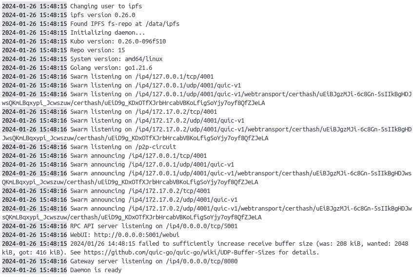
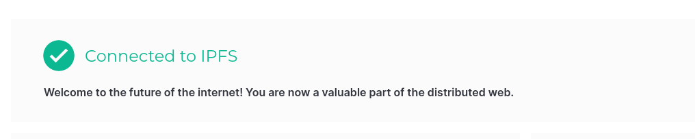

## IPFS Kubo Docker installation Guide

1. Make sure **Docker** is installed & running
2. Inside `../Decentralized/IPFS` its two folders `ipfs_staging` and `ipfs_data` that are created, if not create them.
3. Pull the image, run in terminal `docker pull ipfs/kubo`
4. Run the docker-container with `docker run -d --name ipfs_host \
  -v ~/dev/github/D0020E/Decentralized/IPFS/ipfs_staging:/export \
  -v ~/dev/github/D0020E/Decentralized/IPFS/ipfs_data:/data/ipfs \
  -p 4001:4001 -p 4001:4001/udp -p 127.0.0.1:8080:8080 -p 127.0.0.1:5001:5001 \
  ipfs/kubo:latest` and replace the paths with your actual paths to the `ipfs_staging` and `ipfs_data` 
  5. Check the container logs, either with `docker logs -f ipfs_host` or inside Docker Desktop, should look like the image 
  6. Access the WebUI at http://0.0.0.0:5001/webui or http://127.0.0.1:5001/webui and confirm that its connected to IPFS 
  7. If you are having connection issues, make sure that the your firewall have opened/allowed ports 5001 (RPC API) and 8080 (IPFS Gateway) or the specific ports your entered in the docker run command
  8. Check peer connections with either visiting http://localhost:3000/getPeers if the Express API is running otherwise navigate to peers inside the webui 

More info can be found at either https://docs.ipfs.tech/install/run-ipfs-inside-docker/#set-up
 or https://docs.ipfs.tech/how-to/troubleshooting/

## Running the Express API
1. Just run `npm install` to get everthing and start with `npm start` to make nodemon running.