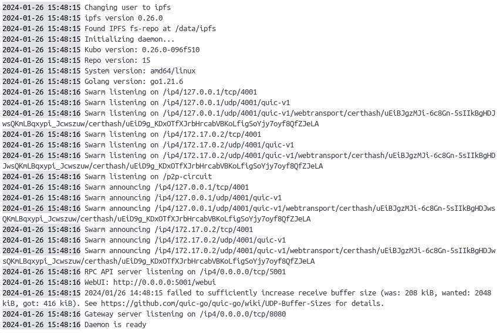
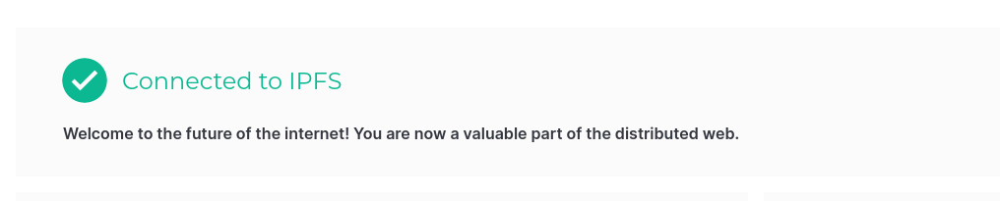
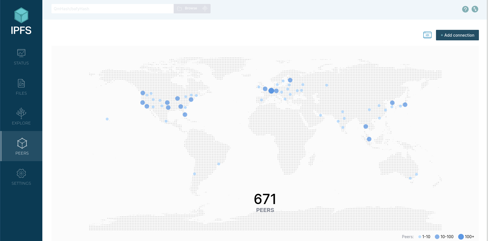

# Demand-Supply Matching (DSM) service

This is part of a [project course](https://www.ltu.se/edu/course/D00/D0020E/D0020E-Projekt-i-datateknik-1.112677?kursView=kursplan&l=en) in Computer Science for students in their third year at Luleå tekniska universitet.

## The project
The project revolves around a already developed Demand-Supply Matching service. Our contribution is the decentralized and RBAC part, using [IPFS](https://github.com/ipfs).  

## Group members
[Ludvig Järvi](https://github.com/Jaevii)  
[Anton Follinger](https://github.com/Hundmat)   
[Daniel Hammar](https://github.com/DanielHammar)   
[Martin Höglund](https://github.com/LarsHajdronKolajder)  

# WARNING: Documentation may be outdated from parent repo

Builds a container containing [Digiprime](https://github.com/norlen/Digiprime)
and [Negotiation Engine](https://github.com/norlen/NegotiationEngine).

It also starts a [MongoDB](https://www.mongodb.com/) server that both
applications use. Authentication is handled by
[Keycloak](https://www.keycloak.org/) which is started as well.

An automated build of the container exists on
[Docker Hub](https://hub.docker.com/r/norlen/digiprime). To use this replace
`digiprime` with `norlen/digiprime:latest` in the commands below.


## Build

Get the source, the submodules **must** be cloned as well for the build to be
valid.

```bash
git clone --recurse-submodules https://github.com/LarsHajdronKolajder/digiprime-container
cd digiprime-container
docker build . -t digiprime     # Build container
```

## Development build

Instructions to start a development build exist here, currently production
builds are not supported. To use the pre-built image replace `digiprime` with
`norlen/digiprime:latest`. If the image has been pulled before run
`docker image rm norlen/digiprime:latest` to clear it.

The most basic way to run is

```bash
docker run -p 3000:3000 \
  --env MAPBOX_TOKEN=<your token> \
  digiprime
```

Runs Digiprime which is avaiable at [`http://localhost:3000`](http://localhost:3000).

To instead run a more complete build with image uploading support, data
persistance, and a custom keycloak admin user run

```bash
docker run -p 3000:3000 \
  --env MAPBOX_TOKEN=<your token> \
  --env CLOUDINARY_CLOUD_NAME=<your info> \
  --env CLOUDINARY_KEY=<your info> \
  --env CLOUDINARY_SECRET=<your info> \
  --env APIKEY=<project_api_key> \
  --env LEDGER_URL=<your MongoDB url> \
  -p 105:105 \
  -p 107:107 \
  -v mongodb_data:/data/db \
  digiprime
```
Get in contact with me to get the keys to run a proper version.

This starts the Digiprime server on [`http://localhost:3000`](http://localhost:3000).

### Environment variables

**Required** environment variables:

- `MAPBOX_TOKEN`: [Mapbox](https://www.mapbox.com/) API key.
- `SECRET`: Key to encrypt cookies. Default value is `thisshouldbeabettersecret` so this should be set to another value for the server to be secure. The way it is set up is that it accepts a comma separated list of secrets, where the first one is used to sign new cookies. This allows for rolling updates of secrets, example `new,old`. See [express-session](https://www.npmjs.com/package/express-session) for more information.
- `CLOUDINARY_CLOUD_NAME`: [Cloudinary](https://cloudinary.com/) cloud name.
- `CLOUDINARY_KEY`: [Cloudinary](https://cloudinary.com/) API key.
- `CLOUDINARY_SECRET`: [Cloudinary](https://cloudinary.com/) secret.

Configurable values:

- `BASE_URL`: If the application is served on a subpath, this controls which one, default: `""`.
- `NODE_ENV`: defaults to `development`, can optionally be set to `production` to hide debug information such as stack traces.
- `AUTH_BASE_URL`: default path to the auth server.

For completeness, the other environent variables are shown here but they should
not be changed.

- `DB_URL`: Database URL for Digiprime, can be set to use another database.
- `PORT`: Port to launch Digiprime. However, the image only exposes port `3000` so leave this alone.
- `DATABASE_URL`: Database URL for Negotiation Engine, can be set to use another database.
- `LEDGER_URL`: MongoDB database URL for the Ledger, use your own.

### Persisting data

To keep data between runs [docker volumes](https://docs.docker.com/storage/volumes/) should be used.

To persist MongoDB mount `/data/db` which is where Mongo stores the data.

# RBAC

Our RBAC system is built on top of an existing RBAC system, which couldn't be modified. This led to the development of our system, featuring a simplified visual frontend. While the frontend was simple, the backend was especially developt to seamlessly integrate with the pre-existing RBAC system, ensuring that the vital controls and checks will work.


### MongoDB

User login credentials will be securely stored in MongoDB. Initially, certain information will only be modifiable through direct database access, such as role and seller.

#### Setup

Setting up your own MongoDB cloud server is required for the Ledger to work fully.

Example MongoDB structure

- `DATABASE NAME`
  - `COLLECTION NAME`

The required MongoDB structure is:

- `Users`
  - `ID`

- `SignatureID`
  - `Signature`


#### Database information for RBAC:

- `username`: Represents the account holder's username on the website.
- `password`: Encrypted password used for account authentication.
- `role`: Defines the user's role, with options including sel for sellers, dev for developers, and bro for brokers.
- - `sel`: This is the role for accounts that can sell.
  - `dev`: This is just a developer account.
  - `bro`: This is the role of a broker that let you sell for other accounts
- `seller`: Specific to broker accounts, indicating the sellers they are authorized to represent.

#### Example


## Guidelines for Utilizing the Login System

### Login and Signup
When the user access the `new offer` page they will have to fill out the `BatteryID`, when this is done and the user press _Hämta API_ (fetch API) they will be promted with the login system. Where inputs are seperated with `:`

#### Login

- `login`: Represents the command that log the user into the account.
- `username`: Represents the account holder's username on the website.
- `password`: Pssword used for account authentication.

#### Signup

- `signup`: Represents the command that create an account.
- `username`: Represents the new accounts username on the website.
- `password`: Pssword used for account authentication.

#### Limitations
To enable users to create an offer, they must log into an account with the necessary selling rights. Additionally, users must provide the site with a `BatteryID` that they own. If the `BatteryID` does not exist in the database, it will be created and linked to the logged-in user's account.


# Overall installation
## 1. Installation Dependencies

### 1. Docker needs to be installed, either [Docker Desktop](https://www.docker.com/products/docker-desktop/) or [Docker Engine](https://docs.docker.com/engine/install/)
### 2. You will also need npm for this project to work [npm](https://docs.npmjs.com/downloading-and-installing-node-js-and-npm)
### 3. The project used MongoDB (especially Atlas) to manage the data in the cloud, you can download and get started with atlas [here](https://www.mongodb.com/docs/atlas/getting-started/) to get your connection string ready for usage (Used within ./Ledger/app.py aswell as ./Decentralized/app.py)

## 2. Docker setup (Different networks)
### 1. Create a new docker network with command `docket network create my-network`, this `my-network` will be the network that you will join together the Digiprime container, Kubo container and Rest API.
### 2. When setting up either the Digiprime container, Kubo container or Rest API you will need to include within the run command `--network my_network` to have them accessable within all three docker containers

## 3. Docker setup (Kubo)
### 1. Make sure **Docker** is installed & running `docker --version` in CLI
### 2. Inside `../Decentralized/IPFS` its two folders `ipfs_staging` and `ipfs_data` that are created, if not create them.
### 3. Pull the image, run in terminal `docker pull ipfs/kubo`
### 4. Run the docker-container with `docker run -d --name ipfs_host --network my_network \
###  -v ~/dev/github/D0020E/Decentralized/IPFS/ipfs_staging:/export \
###  -v ~/dev/github/D0020E/Decentralized/IPFS/ipfs_data:/data/ipfs \
###  -p 4001:4001 -p 4001:4001/udp -p 127.0.0.1:8080:8080 -p 127.0.0.1:5001:5001 \
###  ipfs/kubo:latest` and replace the paths with your actual paths to the `ipfs_staging` and `ipfs_data` 
### 5. Check the container logs, either with `docker logs -f ipfs_host` or inside Docker Desktop, should look like the image 
### 6. Access the WebUI at http://0.0.0.0:5001/webui or http://127.0.0.1:5001/webui and confirm that its connected to IPFS 
### 7. If you are having connection issues, make sure that the your firewall have opened/allowed ports 5001 (RPC API) and 8080 (IPFS Gateway) or the specific ports your entered in the docker run command
### 8. You could also need to open port 4001 inside your router (Both ways, i.e UDP/TCP)
### 9. Check peer connections with either visiting http://localhost:3000/getPeers if the Express API is running otherwise navigate to peers inside the webui 

### More info can be found at either https://docs.ipfs.tech/install/run-ipfs-inside-docker/#set-up or https://docs.ipfs.tech/how-to/troubleshooting/


## 4. Running the Express API
### 1. Just run `npm install` to get everthing and start with `npm start` to make nodemon running.
### 2. Check connectivity with Postman/curl/thunderclient to API by calling `http://ip_addr:port/getPeers` (this will also check Kubos connectivity to other peers within the IPFS network)


## 5. Env files to run the project
### 1. Your own MongoDB atlas connection string you can locate here through MongoDBs own [guide](https://www.mongodb.com/docs/guides/atlas/connection-string/)
### 2. Digiprime needs other env to be run, you can contact [who?](who@.se) to give you the credentials


## 6. Example docker run commands
### 1. `docker run -p 3009:3009 -d --name ipfs_api --network testing ipfs_api` for Express Rest API
### 2. `docker run -d --name ipfs_host --network testing  -v ~/dev/github/D0020E/Decentralized/IPFS/ipfs_staging:/export -v ~/dev/github/D0020E/Decentralized/IPFS/ipfs_data:/data/ipfs -p 4001:4001 -p 4001:4001/udp -p 127.0.0.1:8080:8080 -p 127.0.0.1:5001:5001 ipfs/kubo:latest` for Kubo RPC image


## 7. Other setup changes you need to address
### 1. Docker IP changes, since you will be allocated an IP addr when starting your container, it could be different than correctly configurated **./Digiprime/app.js** under "connectSrcUrls", you will need to get these docker ip addresses to be set appropratley otherwise it won't connect due to Helmet CSP.
### 2. Command for finding your docker ip is either `docker inspect -f '{{range .NetworkSettings.Networks}}{{.IPAddress}}{{end}}' <container_name_or_id>` or you can see whats connected to the network by running `docker network inspect my_network` to see information regarding the containers currently connected to your docker network.
  


## License

Licensed under either of

 * Apache License, Version 2.0
   ([LICENSE-APACHE](LICENSE-APACHE) or http://www.apache.org/licenses/LICENSE-2.0)
 * MIT license
   ([LICENSE-MIT](LICENSE-MIT) or http://opensource.org/licenses/MIT)

at your option.

## Contribution

Unless you explicitly state otherwise, any contribution intentionally submitted
for inclusion in the work by you, as defined in the Apache-2.0 license, shall be
dual licensed as above, without any additional terms or conditions.
